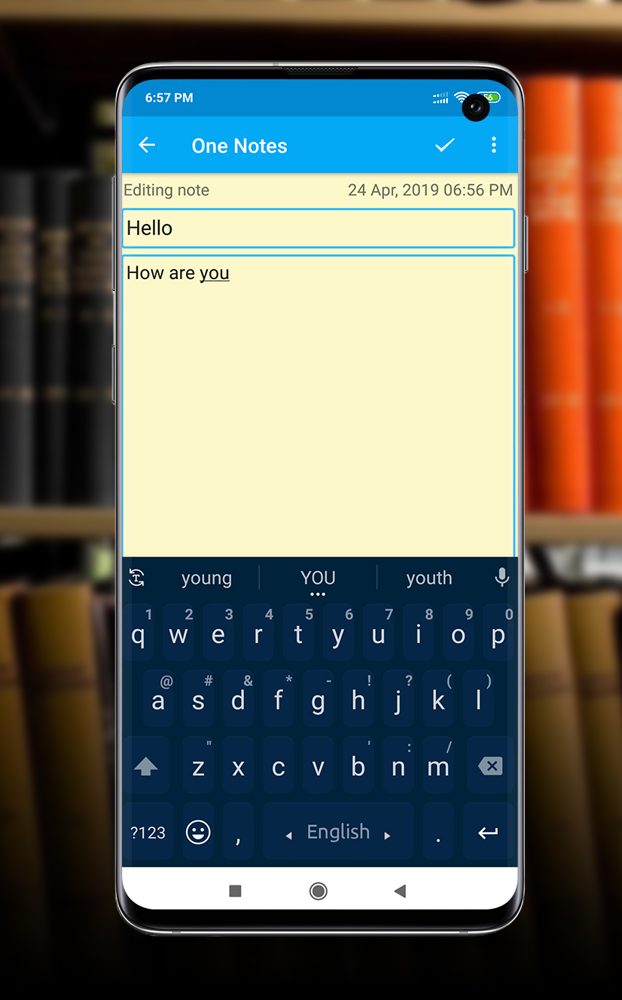

# Daily Notes

1. One Note is very easy and simple notepad that can be used for quick note taking, for your daily
   notes or list maker or as a private notebook.
2. You can take a note or use it as a list maker, mini notebook, daily notes planner, to keep your
   daily notes.
3. You can use it for taking your daily notes, as a list maker of your shopping, take a note while
   need.
4. This mini notebook can be your daily life companion. You can use this color note app for many
   purpose.
5. This online notebook saves your holiday plans, shopping lists, inspirations, or anything that you
   want to organize.
6. This color note app have some random color which will help you to find your specific daily notes
   easily.
7. this notes app have a title bar where you can save your daily notes by giving it a title.
8. You can keep your notes on this digital daily notes planner and use this mini notebook any time
   anywhere.

### Features:

1. It’s an Offline notebook that can be used without internet connection.
2. It’s a list maker of your daily life and keep you more productive.
3. This color note app will help you find your notes with its color.
4. It’s simple, easy and different from the other nots app.
5. Keeps your recorded notes by date and title.
6. Spell check text of your notes and diary.
7. This notes app has a simple theme with user friendly interface.
8. Adjust the text font color used for writing notes or diary.
9. This online notebook has Offline backup and restore.
10. This color note app opens and loads very quickly.
11. Online and offline note taking app.
12. Free Journal app & notepad for android phones and android tablets your daily notes planner.
13. Filling in as a basic word handling program, the content alternative takes into consideration
    the same number of characters as you're willing to type. When spared, you can alter, share, set
    an update, or verify or erase the note through your gadget's menu catch. While scratching off a
    content note, the application puts a cut through the rundown's title, and this will be shown on
    the primary menu.

### Libraries

1. Livedata
2. Room
3. RxJava
4. RxAndroid
5. Glide
6. CircleImageView
7. Dexter

### Preview

| Preview                 | Preview                 |
|-------------------------|-------------------------|
|  |  |
|  |  |
|  |  |

### Install
Install the apk from [here](blob/notes.apk)